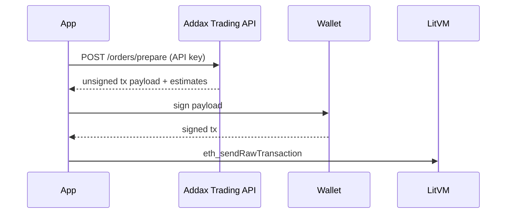

# Trading API

The Addax **Trading API** is the recommended path for programmatic trading. It handles contract resolution, oracle marks, parameter validation, and calldata encoding. Your application receives an **unsigned transaction** to sign with the trader's wallet and broadcast to LitVM.

This follows the same pattern used by leading perp integrations (prepare → sign → send): the server does the heavy lifting.

## Getting an API key

The Trading API is available to approved integrators. There is no self-service signup.

**Request access:** reach out to the protocol team at **[contact@addax.finance](mailto:contact@addax.finance)** with:

- Project or company name  
- Intended use (e.g. trading terminal, automation, research)  
- Expected request volume  
- Delivery email for the key  

If approved, you receive your API key by email. The key is shown **once** — store it in a secrets manager or server environment variable. Never commit it to git or expose it in browser or mobile client code.

To rotate, revoke, or raise rate limits, reach out to the protocol team.

## Base URL

```text
https://api.addax.finance
```

Routes are under `/api/v1`. Local: `http://localhost:3001`.

## Authentication

Pass your API key on every request using either header:

```http
x-addax-api-key: YOUR_API_KEY
```

or

```http
Authorization: Bearer YOUR_API_KEY
```

Unauthenticated or invalid keys receive `401`.

## Rate limits

| Tier | Limit |
|---|---|
| Trading API (per key) | **300 requests / minute** |
| Public REST API (per IP) | **60 requests / minute** |

Responses include standard headers:

```http
X-RateLimit-Limit: 300
X-RateLimit-Remaining: 297
X-RateLimit-Reset: 1734567890
```

When limited, the API returns `429` with a `Retry-After` header. For higher production limits, reach out to the protocol team.

## Workflow



1. **Prepare** — POST order parameters; receive calldata, `to`, `gas`, and fee estimates.
2. **Sign** — Sign locally with the trader wallet (same address as `from` in the request).
3. **Send** — Broadcast the signed transaction to LitVM RPC.

Prepared payloads expire after **120 seconds** (`expiresAt` unix timestamp).

## Endpoints

### `GET /markets`

Returns listed markets, DIA keys, and **all deployed collateral stacks** (USDC, WzkLTC, ADDX).

```bash
curl -s "https://api.addax.finance/api/v1/markets" \
  -H "x-addax-api-key: YOUR_API_KEY"
```

Each stack includes its own `trading`, `storage`, `vault`, and `collateralToken` addresses. Use the stack that matches your margin token when calling `/orders/prepare`.

### `GET /positions`

Enhanced positions read across **all collateral stacks** (USDC, ADDX, WzkLTC). Same shape as the public API, higher rate limit under your key. Each position includes `stackId` and `collateralToken`.

```bash
curl -s "https://api.addax.finance/api/v1/positions?account=0xYourAddress" \
  -H "x-addax-api-key: YOUR_API_KEY"
```

### `POST /orders/prepare`

Build an unsigned transaction for the trader to sign.

#### Open / increase (market)

```bash
curl -s -X POST "https://api.addax.finance/api/v1/orders/prepare" \
  -H "Content-Type: application/json" \
  -H "x-addax-api-key: YOUR_API_KEY" \
  -d '{
    "from": "0xYourWallet",
    "kind": "increase",
    "symbol": "BTC",
    "direction": "long",
    "orderType": "market",
    "marginUsd": "100",
    "leverage": 10
  }'
```

#### Open / increase (limit)

```json
{
  "from": "0xYourWallet",
  "kind": "increase",
  "symbol": "ETH",
  "direction": "short",
  "orderType": "limit",
  "marginUsd": "50",
  "leverage": 5,
  "limitPriceUsd": "3200",
  "takeProfitUsd": "3000",
  "stopLossUsd": "3400"
}
```

#### Close position

```json
{
  "from": "0xYourWallet",
  "kind": "decrease",
  "symbol": "BTC",
  "pairIndex": 0,
  "tradeIndex": 0
}
```

#### Update TP / SL

```json
{
  "from": "0xYourWallet",
  "kind": "update-tp",
  "pairIndex": 0,
  "tradeIndex": 0,
  "newTpUsd": "75000"
}
```

#### Approve collateral (first-time setup per stack)

Approves the collateral ERC-20 for the stack's **storage** contract (required before opening).

USDC:

```json
{
  "from": "0xYourWallet",
  "kind": "approve",
  "collateral": "USDC"
}
```

WzkLTC (gzKLTC stack):

```json
{
  "from": "0xYourWallet",
  "kind": "approve",
  "collateral": "WzkLTC"
}
```

#### Wrap native zkLTC → WzkLTC (gzKLTC stack only)

Perps margin on the zkLTC stack uses **WzkLTC**. If you hold native zkLTC, wrap first:

```json
{
  "from": "0xYourWallet",
  "kind": "wrap",
  "collateral": "zkLTC",
  "wrapAmount": "0.05"
}
```

The returned payload includes a non-zero `value` field (native zkLTC sent with the tx).

#### Open with WzkLTC margin

```json
{
  "from": "0xYourWallet",
  "kind": "increase",
  "collateral": "WzkLTC",
  "symbol": "LTC",
  "direction": "long",
  "orderType": "market",
  "marginAmount": "0.05",
  "leverage": 10
}
```

Use `marginAmount` (token units) for WzkLTC and ADDX. Use `marginUsd` for USDC.

### Prepare response

```json
{
  "requestId": "550e8400-e29b-41d4-a716-446655440000",
  "payloadType": "transaction",
  "mode": "classic",
  "expiresAt": 1734568012,
  "kind": "increase",
  "estimates": {
    "symbol": "BTC",
    "pairIndex": 0,
    "markPriceUsd": 95000,
    "entryPriceUsd": 95000,
    "marginUsd": 100,
    "notionalUsd": 1000,
    "leverage": 10,
    "direction": "long",
    "orderType": "market"
  },
  "payload": {
    "to": "0x468A8eFB014bc7784C3BD1F6F3a7cf7feB07B1e8",
    "data": "0x…",
    "chainId": 4441,
    "from": "0xYourWallet",
    "value": "0",
    "gas": "1200000"
  },
  "contracts": {
    "trading": "0x468A8eFB014bc7784C3BD1F6F3a7cf7feB07B1e8",
    "collateral": "0xA6b7A782Fc4349914dADde5b8A8A8B1daDFBF6DB",
    "storage": "0xEEC2067f8a310B2b09f9b97eC4c5247250D2c712",
    "pairInfos": "0xa574dAE7EbF8cA56a9AC80932bFf9862C6D62FFC",
    "priceAggregator": "0xA184242a075bEA7012Ce83BD86f3E56a9bc33A73",
    "vault": "0xbA68d137F6AaD10a7490DDb94bbd718f59b6A1C6",
    "chainId": 4441
  }
}
```

### Signing the payload (TypeScript / viem)

```typescript
import { createWalletClient, http } from "viem";
import { privateKeyToAccount } from "viem/accounts";

const account = privateKeyToAccount(process.env.TRADER_KEY as `0x${string}`);
const walletClient = createWalletClient({
  account,
  transport: http("https://liteforge.rpc.caldera.xyz/http"),
});

const prepared = await fetch("https://api.addax.finance/api/v1/orders/prepare", {
  method: "POST",
  headers: {
    "Content-Type": "application/json",
    "x-addax-api-key": process.env.ADDAX_API_KEY!,
  },
  body: JSON.stringify({
    from: account.address,
    kind: "increase",
    symbol: "BTC",
    direction: "long",
    orderType: "market",
    marginUsd: "100",
    leverage: 10,
  }),
}).then((r) => r.json());

const hash = await walletClient.sendTransaction({
  to: prepared.payload.to,
  data: prepared.payload.data,
  chainId: prepared.payload.chainId,
  gas: BigInt(prepared.payload.gas),
  value: 0n,
});
```

## Request fields (`POST /orders/prepare`)

| Field | Required | Description |
|---|---|---|
| `from` | Yes | Trader wallet (must sign the returned tx) |
| `kind` | Yes | `increase`, `decrease`, `update-tp`, `update-sl`, `cancel-limit`, `approve`, `wrap` |
| `collateral` | No | `USDC` (default), `WzkLTC`, `zkLTC`, or `ADDX` — selects margin stack |
| `symbol` | For `increase` | Market ticker (`BTC`, `ETH`, `LTC`, …) |
| `direction` | For `increase` | `long` or `short` |
| `orderType` | For `increase` | `market` (default) or `limit` |
| `marginUsd` | For USDC `increase` | Collateral in USDC (human-readable) |
| `marginAmount` | For WzkLTC/ADDX `increase` | Margin in token units (human-readable) |
| `wrapAmount` | For `wrap` | Native zkLTC to deposit into WzkLTC |
| `leverage` | For `increase` | Integer leverage (default `10`) |
| `limitPriceUsd` | For limit opens | Trigger price |
| `takeProfitUsd` / `stopLossUsd` | No | Optional TP/SL at entry |
| `pairIndex` / `tradeIndex` | For close/update | On-chain trade slot (use same `collateral` as the open) |

## Collateral stacks

| `collateral` | Margin token | Stack | Notes |
|---|---|---|---|
| `USDC` | USDC | gUSDC | `marginUsd` |
| `WzkLTC` | WzkLTC | gzKLTC | `marginAmount` in WzkLTC |
| `zkLTC` | native zkLTC | gzKLTC | Use `kind: "wrap"` only; margin trades use `WzkLTC` |
| `ADDX` | ADDX | gADDX | `marginAmount` in ADDX |

Typical gzKLTC flow: **wrap** (if needed) → **approve** (`collateral: "WzkLTC"`) → **increase** (`collateral: "WzkLTC"`).

## Errors

| Status | Meaning |
|---|---|
| `400` | Invalid parameters or failed validation (min size, TP/SL, limit price) |
| `401` | Missing or invalid API key |
| `429` | Rate limit exceeded |
| `503` | Trading API temporarily unavailable |

## Related

- [Public REST API](./public-api.md) — read-only endpoints (no key, lower limits)
- [Direct Contract Integration](./contracts.md) — raw ABI reference
- [Contracts & Addresses](../protocol/contracts.md) — deployment registry
