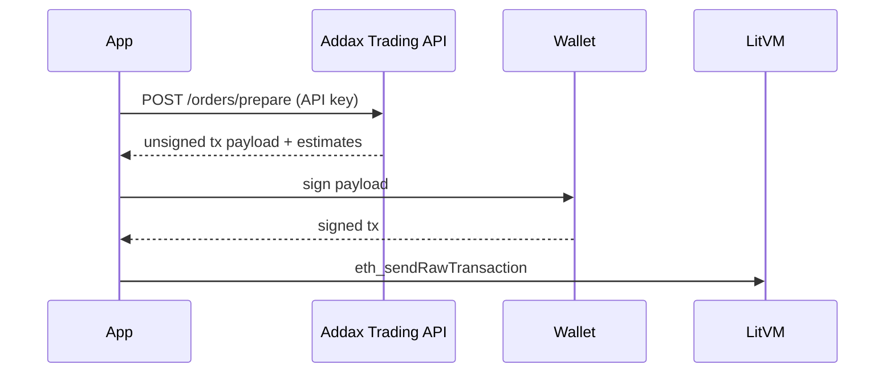

# Trading API

The Addax **Trading API** is the recommended path for programmatic trading. It handles contract resolution, oracle marks, parameter validation, and calldata encoding. Your application receives an **unsigned transaction** to sign with the trader's wallet and broadcast to LitVM.

This follows the same pattern used by leading perp integrations (prepare → sign → send): the server does the heavy lifting; keys never leave your environment.

## Getting an API key

The Trading API is available to approved integrators. There is no self-service signup.

**Request access:** email **[contact@addax.finance](mailto:contact@addax.finance)** with:

- Project or company name  
- Intended use (e.g. trading terminal, automation, research)  
- Expected request volume  
- Email address where the key should be delivered  

If approved, Addax sends your API key to that address from **auth@addax.finance**. The key is shown **once** — store it in a secrets manager or server environment variable. Never commit it to git or expose it in browser or mobile client code.

To rotate, revoke, or raise rate limits, contact **[contact@addax.finance](mailto:contact@addax.finance)**.

## Base URL

```text
https://addax.finance/api/v1
```

## Authentication

Pass your API key on every request using either header:

```http
x-addax-api-key: YOUR_API_KEY
```

or

```http
Authorization: Bearer YOUR_API_KEY
```

Unauthenticated or invalid keys receive `401`.

## Rate limits

| Tier | Limit |
|---|---|
| Trading API (per key) | **300 requests / minute** |
| Public REST API (per IP) | **60 requests / minute** |

Responses include standard headers:

```http
X-RateLimit-Limit: 300
X-RateLimit-Remaining: 297
X-RateLimit-Reset: 1734567890
```

When limited, the API returns `429` with a `Retry-After` header. For production workloads above these limits, contact [contact@addax.finance](mailto:contact@addax.finance).

## Workflow



1. **Prepare** — POST order parameters; receive calldata, `to`, `gas`, and fee estimates.
2. **Sign** — Sign locally with the trader wallet (same address as `from` in the request).
3. **Send** — Broadcast the signed transaction to LitVM RPC.

Prepared payloads expire after **120 seconds** (`expiresAt` unix timestamp).

## Endpoints

### `GET /markets`

Returns listed markets, DIA keys, and gUSDC contract addresses.

```bash
curl -s "https://addax.finance/api/v1/markets" \
  -H "x-addax-api-key: YOUR_API_KEY"
```

### `GET /positions`

Enhanced positions read (same shape as the public API, higher rate limit under your key).

```bash
curl -s "https://addax.finance/api/v1/positions?account=0xYourAddress" \
  -H "x-addax-api-key: YOUR_API_KEY"
```

### `POST /orders/prepare`

Build an unsigned transaction for the trader to sign.

#### Open / increase (market)

```bash
curl -s -X POST "https://addax.finance/api/v1/orders/prepare" \
  -H "Content-Type: application/json" \
  -H "x-addax-api-key: YOUR_API_KEY" \
  -d '{
    "from": "0xYourWallet",
    "kind": "increase",
    "symbol": "BTC",
    "direction": "long",
    "orderType": "market",
    "marginUsd": "100",
    "leverage": 10
  }'
```

#### Open / increase (limit)

```json
{
  "from": "0xYourWallet",
  "kind": "increase",
  "symbol": "ETH",
  "direction": "short",
  "orderType": "limit",
  "marginUsd": "50",
  "leverage": 5,
  "limitPriceUsd": "3200",
  "takeProfitUsd": "3000",
  "stopLossUsd": "3400"
}
```

#### Close position

```json
{
  "from": "0xYourWallet",
  "kind": "decrease",
  "symbol": "BTC",
  "pairIndex": 0,
  "tradeIndex": 0
}
```

#### Update TP / SL

```json
{
  "from": "0xYourWallet",
  "kind": "update-tp",
  "pairIndex": 0,
  "tradeIndex": 0,
  "newTpUsd": "75000"
}
```

#### Approve USDC (first-time setup)

```json
{
  "from": "0xYourWallet",
  "kind": "approve"
}
```

### Prepare response

```json
{
  "requestId": "550e8400-e29b-41d4-a716-446655440000",
  "payloadType": "transaction",
  "mode": "classic",
  "expiresAt": 1734568012,
  "kind": "increase",
  "estimates": {
    "symbol": "BTC",
    "pairIndex": 0,
    "markPriceUsd": 95000,
    "entryPriceUsd": 95000,
    "marginUsd": 100,
    "notionalUsd": 1000,
    "leverage": 10,
    "direction": "long",
    "orderType": "market"
  },
  "payload": {
    "to": "0x468A8eFB014bc7784C3BD1F6F3a7cf7feB07B1e8",
    "data": "0x…",
    "chainId": 4441,
    "from": "0xYourWallet",
    "value": "0",
    "gas": "1200000"
  },
  "contracts": {
    "trading": "0x468A8eFB014bc7784C3BD1F6F3a7cf7feB07B1e8",
    "collateral": "0xA6b7A782Fc4349914dADde5b8A8A8B1daDFBF6DB",
    "storage": "0xEEC2067f8a310B2b09f9b97eC4c5247250D2c712",
    "pairInfos": "0xa574dAE7EbF8cA56a9AC80932bFf9862C6D62FFC",
    "priceAggregator": "0xA184242a075bEA7012Ce83BD86f3E56a9bc33A73",
    "vault": "0xbA68d137F6AaD10a7490DDb94bbd718f59b6A1C6",
    "chainId": 4441
  }
}
```

### Signing the payload (TypeScript / viem)

```typescript
import { createWalletClient, http } from "viem";
import { privateKeyToAccount } from "viem/accounts";

const account = privateKeyToAccount(process.env.TRADER_KEY as `0x${string}`);
const walletClient = createWalletClient({
  account,
  transport: http("https://liteforge.rpc.caldera.xyz/http"),
});

const prepared = await fetch("https://addax.finance/api/v1/orders/prepare", {
  method: "POST",
  headers: {
    "Content-Type": "application/json",
    "x-addax-api-key": process.env.ADDAX_API_KEY!,
  },
  body: JSON.stringify({
    from: account.address,
    kind: "increase",
    symbol: "BTC",
    direction: "long",
    orderType: "market",
    marginUsd: "100",
    leverage: 10,
  }),
}).then((r) => r.json());

const hash = await walletClient.sendTransaction({
  to: prepared.payload.to,
  data: prepared.payload.data,
  chainId: prepared.payload.chainId,
  gas: BigInt(prepared.payload.gas),
  value: 0n,
});
```

## Request fields (`POST /orders/prepare`)

| Field | Required | Description |
|---|---|---|
| `from` | Yes | Trader wallet (must sign the returned tx) |
| `kind` | Yes | `increase`, `decrease`, `update-tp`, `update-sl`, `cancel-limit`, `approve` |
| `symbol` | For `increase` | Market ticker (`BTC`, `ETH`, …) |
| `direction` | For `increase` | `long` or `short` |
| `orderType` | For `increase` | `market` (default) or `limit` |
| `marginUsd` | For `increase` | Collateral in USDC (human-readable) |
| `leverage` | For `increase` | Integer leverage (default `10`) |
| `limitPriceUsd` | For limit opens | Trigger price |
| `takeProfitUsd` / `stopLossUsd` | No | Optional TP/SL at entry |
| `pairIndex` / `tradeIndex` | For close/update | On-chain trade slot |

## Errors

| Status | Meaning |
|---|---|
| `400` | Invalid parameters or failed validation (min size, TP/SL, limit price) |
| `401` | Missing or invalid API key |
| `429` | Rate limit exceeded |
| `503` | Trading API temporarily unavailable |

## Related

- [Public REST API](./public-api.md) — read-only endpoints (no key, lower limits)
- [Direct Contract Integration](./contracts.md) — raw ABI reference
- [Contracts & Addresses](../protocol/contracts.md) — deployment registry
